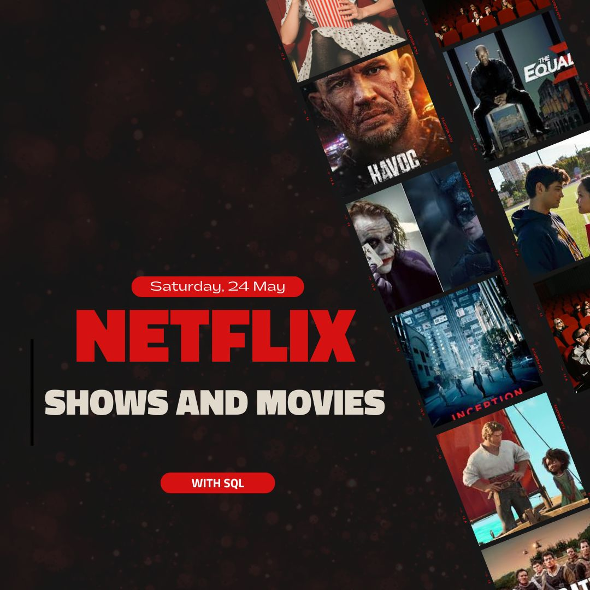

# Netflix Data Analysis Project Using SQL

## Overview
This project aims to analyze Netflix’s content using structured SQL queries to derive meaningful business insights. The analysis covers content type distribution, country-wise trends, director and actor performance, content ratings, and viewer-relevant classifications.

## Goals
Explore trends and patterns across Netflix’s movies and TV shows.
Identify popular genres, ratings, and contributing countries.
Discover content gaps (e.g., missing directors) and top contributors (e.g., directors, actors).
Classify content based on keywords and viewer perceptions.

## Tools Used
**Database:** PostgreSQL
**Language:** SQL
**Dataset:** Netflix content database (includes show_id, type, title, director, casts, country, date_added, release_year, rating, duration, listed_in, description)

## Key Business Questions Solved
**1️⃣ Count of Movies vs TV Shows**

Reveals content distribution across types using GROUP BY.

**2️⃣ Most Common Rating per Type**

Uses RANK() to extract the top rating per content type.

**3️⃣ Movies Released in 2020**

Simple filter to show content by year and type.

**4️⃣ Top 5 Countries by Content Count**

Breaks down multi-country fields using STRING_TO_ARRAY and ranks by content volume.

**5️⃣ Longest Movie on Netflix**

Parses duration to find the longest movie using SPLIT_PART.

**6️⃣ Content Added in the Last 5 Years**

Converts date_added string to date for temporal filtering.

**7️⃣ Top 3 Directors by Movie Count**

Uses UNNEST and TRIM to extract director names and aggregate.

**8️⃣ TV Shows With More Than 5 Seasons**

Filters TV shows based on season count using string parsing.

**9️⃣ Top 5 Genres on Netflix**

Unpacks genres using UNNEST, then counts appearances.

**🔟 Average Annual Indian Releases**

Calculates the percentage of Indian content released per year.

**1️⃣1️⃣ Bangladeshi Movies**

Searches titles using ILIKE '%Bangladesh%'.

**1️⃣2️⃣ Content Without Directors**

Counts entries with NULL director fields.

**1️⃣3️⃣ Salman Khan Movies (Last 10 Years)**

Uses UNNEST, TRIM, and filtering by actor and date.

**1️⃣4️⃣ Top 10 Indian Actors by Movie Count**

Ranks most frequent actors in Indian content using UNNEST.

**1️⃣5️⃣ Classify Content as "Good" or "Bad"**

Uses CASE with ILIKE on the description to label and count content based on violent keywords.

## Insights & Learnings
Netflix contains more Movies than TV Shows.
The most common ratings vary significantly by type.
India, USA, UK, Canada, and Japan are top content contributors.
Some actors and directors dominate specific regional markets.
Several records lack director information—data quality opportunity.
Content with violent keywords exists and can be filtered or flagged for parental control purposes.

## Conclusion
This project demonstrates how SQL can be used to extract deep business insights from streaming platform data. Whether it’s for content acquisition, regional strategy, or consumer sentiment filtering, structured queries can drive data-informed decisions.

-- End This Project
